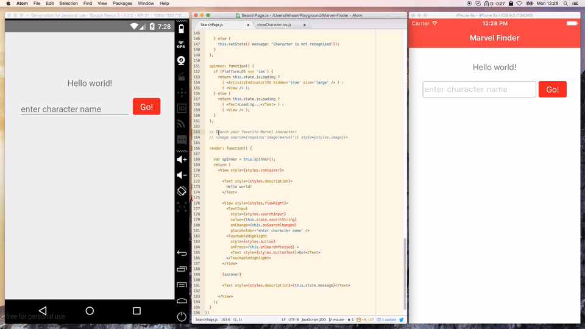
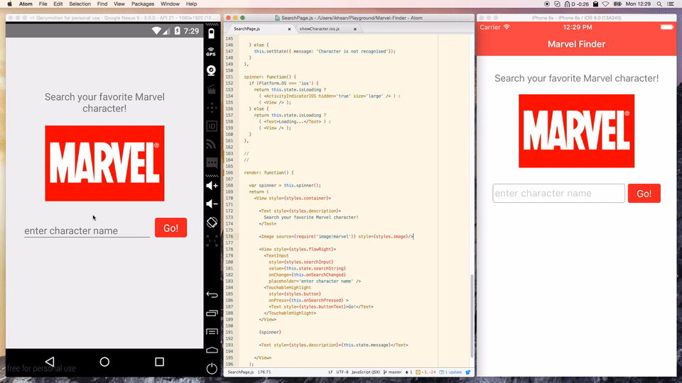

# Marvel Finder
React native application to find marvel characters.

# Screenshots





## React native installation

- Use [`nvm`](https://github.com/creationix/nvm) to install the latest stable node version
- Use homebrew to install watchman and flow

```sh
$ nvm install stable
$ brew install watchman
$ brew install flow # optional
$ npm install -g react-native-cli
```

## To run the app

Install Xcode and follow the [Android setup guide](https://facebook.github.io/react-native/docs/android-setup.html).

```sh
$ npm install
$ react-native run-android # for android, and open 'ios' folder on Xcode for iOS
```
